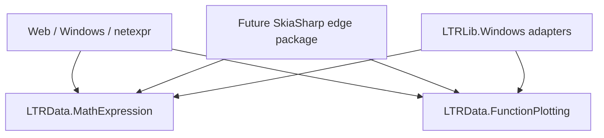

# Architecture, dependency boundaries, and proposed public APIs

## Intended dependency graph



There is no dependency from plotting to expressions. An expression-bound unary function
is merely one producer of `double f(double x)`.

Within `LTRData.MathExpression`, dependencies flow in one direction:

```text
source -> lexer/parser -> immutable syntax -> binder/catalog -> interpreted evaluator
                                      |
                                      +-> future diagram content/layout
```

`System.Linq.Expressions` may later be an export target. It is not syntax.

## Package boundary decisions

| Package/project | Boundary decision | Dependency isolated | Known consumers | What other consumers avoid | Different TFM/version need? |
|---|---|---|---|---|---|
| `LTRData.MathExpression` | Keep existing package; add modern APIs beside legacy types during experiment | Keeps parsing/evaluation free of graphics and future SkiaSharp | `netexpr`, GraphViewer, web | `netexpr` avoids plotting/rendering dependencies | No new version boundary; existing name remains adequate |
| `LTRData.FunctionPlotting` | Add one portable project/package | Prevents plotting from depending on parser and its current `LTRData.Extensions` reference | GraphViewer, web, arbitrary numerical callers | Expression-only consumers avoid plotting; plotting-only consumers avoid parser/extensions | Same broad repository TFMs initially; independently useful API justifies consumption boundary |
| expression diagrams | Namespace/types in `LTRData.MathExpression`, not a separate package | No external dependency to isolate in content/layout | Web first; possible educational/debug consumers | Nothing meaningful would be avoided by another package | No independent target/version need found |
| future SkiaSharp edge | One package for both plot and expression-diagram raster rendering | SkiaSharp managed/native assets, font/raster deployment, PNG encoding | Unix ASP.NET application | Windows and calculation-only consumers avoid SkiaSharp entirely | Yes: external/native dependency and modern server TFMs |
| System.Drawing edge | Keep in `LTRLib.Windows` initially | Windows-only API and legacy TFMs | Windows GraphViewer | All portable/server consumers avoid System.Drawing | Yes: Windows-specific targets; compatibility release lifecycle |

No separate packages are proposed for lexer, syntax, binding, evaluation, layout, rendering,
or PNG encoding merely because they are conceptual stages.

## Proposed expression API

Signatures are reviewable proposals. The experimental slice implements the central forms.

```csharp
MathParseResult parse = MathParser.Default.Parse("sin(x) + x^2");

if (!parse.Success)
{
    foreach (MathDiagnostic diagnostic in parse.Diagnostics)
    {
        Console.Error.WriteLine($"{diagnostic.Span}: {diagnostic.Message}");
    }
}

MathBindingResult binding = MathBinder.Bind(
    parse.Root!,
    MathSymbolCatalog.Standard);

BoundMathExpression expression = binding.Expression!;
UnaryMathFunction function = expression.BindUnary("x");
double y = function.Evaluate(1.25);
```

Arbitrary variables use stable slots:

```csharp
foreach (MathVariable variable in expression.Variables)
{
    Console.WriteLine($"{variable.Slot}: {variable.Name}");
}

double result = expression.Evaluate(valuesBySlot);
```

Custom symbols are explicit:

```csharp
MathSymbolCatalog symbols = MathSymbolCatalog.CreateBuilder()
    .AddConstant("g", 9.80665)
    .AddFunction("square", x => x * x)
    .Build();
```

The builder is mutable construction state; the resulting catalog is immutable and safe to
share. No provider assembly/type scan occurs during parsing or evaluation.

## Proposed plotting API

```csharp
SampleSeries samples = FunctionSampler.Sample(
    function.Evaluate,
    new NumericRange(-10, 10),
    sampleCount: 1200);

var viewport = new PlotViewport(
    new NumericRange(-10, 10),
    new NumericRange(-4, 4),
    new CanvasSize(1200, 720));

CurveGeometry geometry = CurveGeometryBuilder.Build(samples, viewport);
```

`SampleSeries` retains the original data coordinates and a status per sample. Geometry is
a collection of continuous-coordinate polylines; it contains no pixels, colors, pens,
paths, fonts, or renderer objects.

The validation slice deliberately uses fixed-count endpoint-inclusive sampling. The count
is explicit and unrelated to a rectangle's pixel-loop convention. Geometry breaks at
invalid samples and performs proper rectangular clipping. It does not yet claim to detect
finite-valued asymptotes.

## Future expression-diagram boundary

Planned flow inside the existing math package:

```text
MathSyntax or semantic expression
    -> ExpressionDiagram (node IDs, labels, roles, ordered edges)
    -> backend-measured node sizes
    -> TreeDiagramLayout (rectangles and connectors)
```

The Skia/System.Drawing adapter measures labels using the actual font backend and supplies
sizes to portable layout. This avoids both renderer-owned layout and a general-purpose
`IGraphics.MeasureText/DrawString` abstraction.

## Future renderer integration

Backend-specific APIs should directly accept backend objects:

```csharp
skiaPlotRenderer.Render(SKCanvas canvas, CurveGeometry geometry, SkiaPlotTheme theme);
skiaDiagramRenderer.Render(SKCanvas canvas, ExpressionDiagramLayout layout,
                            SkiaDiagramTheme theme);
skiaPngEncoder.Encode(SKImage image, Stream destination);

systemDrawingPlotRenderer.Render(Graphics graphics, CurveGeometry geometry,
                                 SystemDrawingPlotTheme theme);
```

Rendering and encoding remain separate concepts inside the edge package, but do not need
separate packages.

## Intentional compatibility breaks

| Legacy behavior/API | Modern decision | Reason |
|---|---|---|
| Parser returns LINQ `Expression` | Parser returns math syntax and diagnostics | Source spans, diagrams, AOT interpretation, and language ownership |
| `ScriptControl.Expression` setter compiles and mutates state | Explicit parse, bind, and optional unary binding | Predictable immutable stages |
| Only `x` and `y` can be compiled | Arbitrary bound variable slots; plotting explicitly binds unary `x` | Required by `netexpr`; no hidden special variables |
| Current culture configurable grammar | Invariant formula language | Stable storage/server semantics and unambiguous comma |
| Current power grouping | Conventional right-associative power above unary sign | Existing results are artifacts without consumer evidence |
| Empty input is zero | Parse diagnostic | Avoid silently graphing missing input |
| Reflection provider types | Explicit symbol catalog | AOT/trimming safety and deterministic public contract |
| Exceptions become nullable values | Direct evaluation propagates; sampling classifies | Distinguishes evaluation, non-finite result, and missing expression |
| Previous `y` always fed back | Unary ordinary function | No first-party use; recurrence can be explicit legacy functionality |
| Sampling tied to inclusive pixel coordinates | Explicit numerical sample count | Calculation independent of renderer |
| Integral wraps at viewport | Never alter numerical state for visibility | Mathematical correctness and separation of clipping |
| Refresh appends paths | Explicit overlay composition | Preserve the feature without accidental state mutation |

## Compatibility placement

The existing public classes remain untouched in the experimental slice. Later migration can:

- implement LTRLib `ScriptControl` over the new parser/binder while retaining its nullable
  result and source-normalization behavior where required;
- implement an LTRLib Windows `Surface` adapter with characterized legacy algorithms;
- leave old .NET Framework targets on the legacy implementation while modern GraphViewer
  targets migrate first.

No types named `ScriptControl`, `Surface`, or `Refresh` are added to the modern API.

