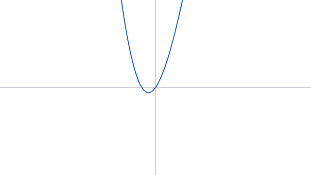
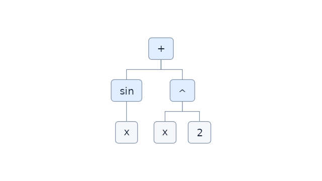

# First rendering slice

This implements the accepted architecture through two server-side PNG compositions.
The companion consumer changes are on `LTRData/ltr-data.se` branch
`experimental/math-expression-rendering`.

## Public boundaries

- `LTRData.MathExpression.Diagrams.ExpressionDiagram.FromSyntax` creates immutable
  node content, source spans, and ordered child roles. Names and numeric spelling
  survive. Operators have conventional labels. Parenthesis nodes are optional.
- This is a **syntax projection**, not a bound semantic diagram or algebraic
  simplifier. Default diagrams omit grouping nodes because edges already express
  grouping. A separate semantic projection remains future work.
- `TreeDiagramLayout.Create` consumes a size per node, measured by the actual font
  backend. Its rectangles and connectors contain no graphics types. Both traversal
  and layout are iterative; layout takes linear time and keeps subtree extents apart.
- `LTRData.Graphics.SkiaSharp` is one edge package, targeting .NET 8/9/10. It references
  the expression and plotting packages and SkiaSharp. The portable projects never
  reference it or SkiaSharp.
- `SkiaDiagramRenderer.MeasureNodes` and `Render` use the same caller-owned `SKFont`.
  `SkiaPlotRenderer.Render` draws supplied geometry; `RenderAxes` draws visible axes.
  Neither renderer clears the canvas or retains paths, so overlays can be composed
  explicitly. `SkiaPngEncoder.Encode` only encodes and leaves its inputs open.

```csharp
var parse = MathParser.Default.Parse("sin(x) + x^2");
// Check parse.Success and report parse.Diagnostics in a real caller.
var diagram = ExpressionDiagram.FromSyntax(parse.Root!);
using var typeface = SKTypeface.FromFamilyName("sans-serif");
using var font = new SKFont(typeface, 20);
var sizes = SkiaDiagramRenderer.MeasureNodes(diagram, font);
var layout = TreeDiagramLayout.Create(diagram, sizes);
using var surface = SKSurface.Create(new SKImageInfo(
    (int)Math.Ceiling(layout.Size.Width), (int)Math.Ceiling(layout.Size.Height)));
surface.Canvas.Clear(SKColors.White);
SkiaDiagramRenderer.Render(surface.Canvas, layout, font);
using var image = surface.Snapshot();
SkiaPngEncoder.Encode(image, destinationStream);
```

For plots, parse/bind once, call `BindUnary("x")`, sample its `Evaluate` delegate, and
build `CurveGeometry` for a viewport before passing it to the Skia renderer. Arbitrary
numerical callers can supply a scalar delegate without using an expression parser.

## Samples

Both images below were generated by the actual website page/service through its
HTTP PNG routes on Linux, at 640 × 360, for `sin(x) + x^2` (X −10..10, Y −4..4).





## Native deployment and fonts

The edge package pins **SkiaSharp 4.151.2**. The executable application chooses its
native assets; the website and rendering tests reference
`SkiaSharp.NativeAssets.Linux` at the same version. The managed SkiaSharp package
also brings the Windows/macOS assets. On Linux, install Fontconfig and usable fonts
(for example `libfontconfig1` and `fonts-dejavu-core` on Ubuntu).

For deterministic diagram text, the website accepts `GraphViewer:FontPath`, or the
environment variable `GraphViewer__FontPath`, pointing to a deployed TTF/OTF file.
The application owns font selection and font-file distribution/licensing. Complex
text shaping and per-glyph font fallback are outside this slice.

**FreeBSD is a separate native deployment target.** The Linux native package does
not supply FreeBSD assets. A FreeBSD process needs a compatible FreeBSD build of
`libSkiaSharp` for the selected managed version. Do not substitute a Linux shared
library or an older incompatible Skia ABI. The local validation in this slice runs
on Linux; FreeBSD execution remains a deployment check on the target host.

Sources: [SkiaSharp release](https://github.com/mono/SkiaSharp/releases/tag/v4.151.2),
[managed package](https://www.nuget.org/packages/SkiaSharp/4.151.2),
[Linux native package](https://www.nuget.org/packages/SkiaSharp.NativeAssets.Linux/4.151.2).

## Validation and fixes

Local verification: 63 focused core tests and four native renderer tests pass on
.NET 10/Linux, and the review host's HTTP checks pass. The portable math project
also builds for .NET Framework 3.5 with zero warnings. The review host builds with
zero warnings. Other target/runtime combinations remain covered by repository CI
and target-host checks; a local FreeBSD run or full-site build is not claimed.

- The focused expression/plotting suite includes the existing legacy tests, modern
  normative tests, the 18 compatible legacy expression examples, layout tests, and
  large-finite-coordinate regressions.
- Large finite sample differences could overflow during clipping, and viewport
  conversion could overflow an intermediate product. Regression tests reproduced
  both failures. Clipping now sets the crossed boundary exactly and uses scaled
  interpolation when differences overflow; transforms divide before scaling.
- `Rendering.Tests` exercises native PNG decoding/dimensions, visible labels,
  non-finite sample gaps, axis visibility, and encoder ownership on .NET 8/9/10.
- The companion `GraphViewer.Review --verify` checks the actual Razor page and HTTP
  routes, including malformed/oversized requests, multivariable trees, cache reuse,
  HTML encoding, and the concurrent-render limit.

The review host deliberately does not start the full site's database or visit logging.
The full site still requires its existing private `webdbcore` package/feed and normal
deployment configuration.

## Packaging and review

The expression package now uses `1.1.0-preview.1`; the new renderer uses
`0.1.0-preview.1`. This gives the consumer an explicit prerelease dependency instead
of resolving the already published expression package without these APIs. No NuGet
release is performed by this work. Function plotting retains its prototype `0.1.0`.

The companion website supports `LibrarySourcePath` for reviewing these projects
directly. Its review host defaults to a sibling `Library` checkout. See the website's
`docs/math-rendering-review.md` for the one-command UI and HTTP verification paths.

After review, package the math, plotting, and renderer projects into your normal
feed, or continue using an explicit source reference during development.

## Still deferred

Derivative/integral calculation, recurrence, adaptive sampling and finite-asymptote
detection, Windows migration, semantic diagrams, and optional compilation remain
separate work. Fixed-count sampling can miss narrow features or connect across an
asymptote between finite samples; PNG output does not change that contract.

The user preference for `ArgumentNullException.ThrowIfNull` on supporting targets
is used in the new code. A broader optimization pass over the original prototype
guards remains deferred.
